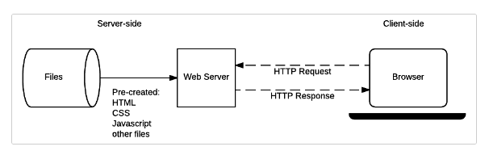
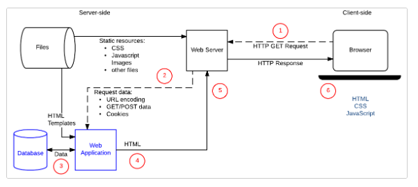

# Introduction to server side.
Understanding additional power available to websites through server-side coding. 
Server-side programming is also known as back-end scripting. 
 

***Two types of websites:***

### Static websites.
Served content is hand-coded and never changes. 
**Basic web server architecture for a static site:**

### Dynamic websites.
Content is produced dynamically, like in HTML content is served through placeholders. 
**Basic web server architecture for a dynamic site:**

## Server-side versus client-side programming.
Client-side code is primarily concerned with improving the appearance and behavior of a rendered web page.
This includes:
* selecting and styling U
